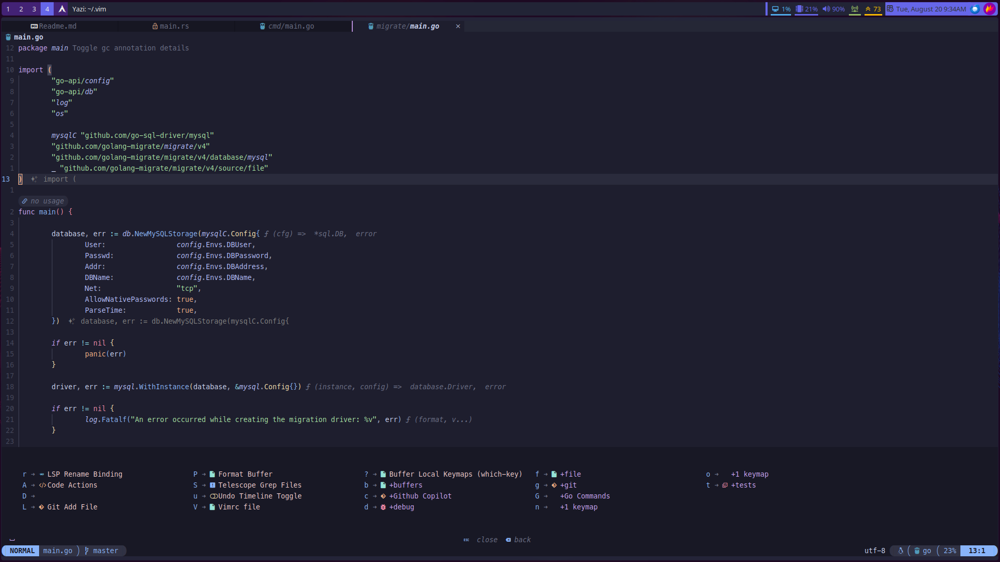

# Nvim Dotfiles
Revamed NeoVim setup for the cultured programmer.

> [!NOTE]
> This repository aims to be OS and agnostic, but there may be slight changes required to duplicate it on non arch-based linux distributions.
> Allow for a complete installation and restart prior to use.

> In the event of a failure to initialize correctly, run:
> ```lua
>   :checkhealth
> ```

## Much Bling, Mouse Never

 

 

 

## Plugins

- actions-preview.nvim
- astrotheme
- barbecue
- bufdelete.nvim
- bufferline.nvim
- catppuccin
- cmp-buffer
- cmp-cmdline
- cmp-dap
- cmp-dbee
- cmp-nvim-lsp
- cmp-path
- cmp_luasnip
- copilot-cmp
- copilot.lua
- CopilotChat.nvim
- crates.nvim
- dbee
- fidget.nvim
- FixCursorHold.nvim
- friendly-snippets
- git-conflict.nvim
- gitsigns.nvim
- go.nvim
- guihua.lua
- headlines.nvim
- indent-blankline.nvim
- kanagawa.nvim
- lazy.nvim
- leap.nvim
- lsp_signature.nvim
- lspkind.nvim
- lualine.nvim
- LuaSnip
- mason
- mason-lspconfig.nvim
- mason-null-ls.nvim
- mason-nvim-dap
- mason.nvim
- markdown-preview.nvim
- mini.icons
- mini.move
- modicator.nvim
- neoformat
- neogen
- neotest
- neotest-dotnet
- neotest-go
- neotest-plenary
- neotest-rust
- night-owl.nvim
- noice.nvim
- none-ls.nvim
- nui.nvim
- nvim-autopairs
- nvim-biscuits
- nvim-cmp
- nvim-colorizer.lua
- nvim-dap
- nvim-dap-cs
- nvim-dap-go
- nvim-dap-ui
- nvim-dap-virtual-text
- nvim-dap-vscode-js
- nvim-lsp-file-operations
- nvim-lspconfig
- nvim-navic
- nvim-nio
- nvim-notify
- nvim-surround
- nvim-tree.lua
- nvim-treesitter
- nvim-ts-autotag
- nvim-web-devicons
- omnisharp-extended-lsp.nvim
- palenightfall.nvim
- pastelnight.nvim
- plenary.nvim
- project.nvim
- rainbow-delimiters.nvim
- rustaceanvim
- sqls.nvim
- startup.nvim
- symbol-usage.nvim
- telescope-dap.nvim
- telescope-fzf-native.nvim
- telescope.nvim
- toggleterm.nvim
- tokyonight.nvim
- typescript-tools.nvim
- typst.vim
- undotree
- vim-fugitive
- vim-illuminate
- vim-matchup
- vim-tmux-navigator
- which-key.nvim
- workspace-diagnostics.nvim
- yazi.nvim
